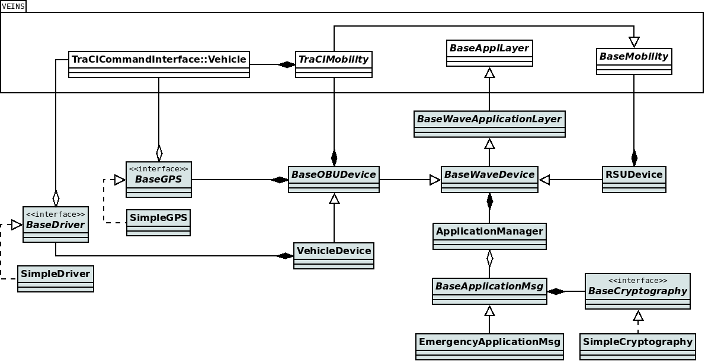

// Documentation for these modules is at http://veins.car2x.org/

# Vehicular Networks: Trends and Case Study

This is a Term paper developed around veins by
[@laurodelacerda](https://github.com/laurodelacerda) and
[@arthurazs](https://github.com/arthurazs). You can check the paper in brazilian portuguese on [arthurazs/la-tcc](https://github.com/arthurazs/la-tcc/blob/master/LA_TCC_V1.pdf) or download it on https://goo.gl/C15sZf.

> The paper describes the development of vehicular networking
> technology, its standardization and tools. Specifically, the IEEE 1609
> standard is investigated in detail. Several examples of vehicular
> technology applications are given. A group of simulation tools is
> analyzed and compared. When some of them are integrated, they allow
> vehicles to be connected in networks. The technology is simulated and
> scrutinized on a case study in a scenario in Rio de Janeiro city.
> Installation and implementation guides that help creating new
> scenarios are attached to this work.

This fork implements three [case studies](/caseStudy), the foundation
for [WAVE applications](src/veins/modules/waveApplication) and an
[EmergencyApplication](src/veins/modules/waveApplication/applications/EmergencyApplication.cc)
that sends emergency messages periodically requesting vehicles to give
way.

